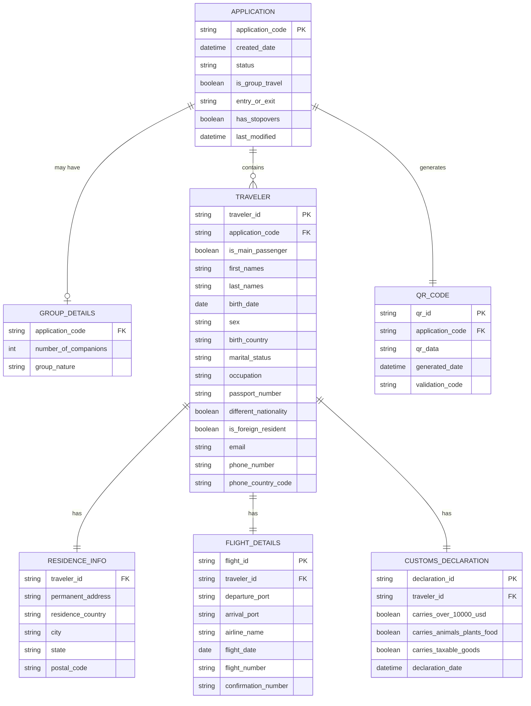

# Entity Relationship Diagram - Current Dominican Republic E-Ticket System

## Overview

This ERD represents the data structure of the existing Dominican Republic E-Ticket system, derived from the field analysis documented in [README.md](README.md). It serves as the baseline for designing the new system's database schema.

## Entity Relationship Diagram



## Entity Descriptions

### **APPLICATION**

The central entity representing a single e-ticket application session.

- **Primary Key**: `application_code` - Unique identifier displayed to users (e.g., "KKYNKM")
- **Key Fields**: Entry/exit type, group travel flag, creation timestamp
- **Business Rules**: One application can contain multiple travelers if group travel is enabled

### **GROUP_DETAILS**

Optional entity for applications involving multiple travelers.

- **Activation Condition**: Only created when `is_group_travel = true`
- **Key Fields**: Number of companions, nature of group relationship
- **Enumerated Values**: Group nature includes "Familia", "Amigos", "Compañeros de trabajo", "Pareja"

### **TRAVELER**

Individual passenger information within an application.

- **Primary Key**: `traveler_id` - System-generated unique identifier
- **Key Relationships**: Belongs to one application, has residence/flight/customs data
- **Business Rules**: One traveler per application for individual travel, multiple for group travel

### **RESIDENCE_INFO**

Permanent residence and address information for each traveler.

- **Relationship**: One-to-one with TRAVELER
- **Key Fields**: Country, city, address details
- **Validation**: Country/city selections are dropdown-driven

### **FLIGHT_DETAILS**

Travel itinerary information for each traveler.

- **Relationship**: One-to-one with TRAVELER
- **Key Fields**: Departure/arrival ports, airline, flight number, dates
- **Note**: Currently stores per-traveler even for groups (potential optimization opportunity)

### **CUSTOMS_DECLARATION**

Customs-related declarations for each traveler.

- **Relationship**: One-to-one with TRAVELER
- **Key Fields**: Three boolean declarations for money, goods, and biological materials
- **Legal Compliance**: Supports Dominican laws 3489 and 155-17

### **QR_CODE**

Generated validation code for the completed application.

- **Relationship**: One-to-one with APPLICATION
- **Key Fields**: QR data payload, generation timestamp, validation code
- **Usage**: "CÓDIGO QR DE USO EXCLUSIVO PARA VALIDACIÓN ADUANAL"

## Data Structure Analysis

### **Current System Characteristics**

- **Application-Centric Design**: Everything revolves around the application code
- **Flat Relationships**: Mostly one-to-one relationships, minimal normalization
- **Group Support**: Basic group functionality through optional GROUP_DETAILS
- **No Draft Support**: Structure assumes completion in single session
- **Redundant Data**: Flight details duplicated across group members

### **Identified Issues**

1. **Data Redundancy**: Flight information repeated for each group traveler
2. **No Versioning**: No support for modifications or draft states
3. **Limited Flexibility**: Rigid structure doesn't support varying form flows
4. **Missing Audit Trail**: No tracking of form progression or modifications

## Implications for New System Design

### **Database Schema Improvements**

```typescript
// Recommended Zod schemas for new system
const ApplicationSchema = z.object({
  applicationCode: z.string(),
  status: z.enum(["draft", "submitted", "completed"]),
  isGroupTravel: z.boolean(),
  entryType: z.enum(["ENTRADA", "SALIDA"]),
  hasStopovers: z.boolean(),
  createdAt: z.date(),
  lastModified: z.date(),
  language: z.string().optional(), // New field
  sessionData: z.record(z.any()).optional(), // For drafts
});

const TravelerSchema = z.object({
  travelerId: z.string(),
  applicationCode: z.string(),
  isMainPassenger: z.boolean(),
  personalInfo: PersonalInfoSchema,
  passportInfo: PassportInfoSchema,
  contactInfo: ContactInfoSchema.optional(),
});

const FlightSchema = z.object({
  flightId: z.string(),
  applicationCode: z.string(), // Shared across group
  departurePort: z.string(),
  arrivalPort: z.string(),
  airline: z.string(),
  flightDate: z.date(),
  flightNumber: z.string(),
  confirmationNumber: z.string().optional(),
});
```

### **Architectural Considerations**

- **Normalize Flight Data**: Share flight details across group members
- **Add Draft Support**: Include session state management
- **Version Control**: Track form modifications and submissions
- **Audit Logging**: Record user interactions and data changes
- **Flexible Schema**: Support conditional fields and dynamic forms

### **Next.js Implementation Strategy**

- **API Routes**: `/api/applications`, `/api/travelers`, `/api/flights`
- **State Management**: Zustand stores mirroring these entities
- **Form Architecture**: Multi-step forms with section-based validation
- **Data Persistence**: Draft saving with localStorage + API sync

This ERD provides the foundation for implementing the improved data architecture outlined in the development plan, supporting both the current system's requirements and the enhanced features planned for the modernized version.
