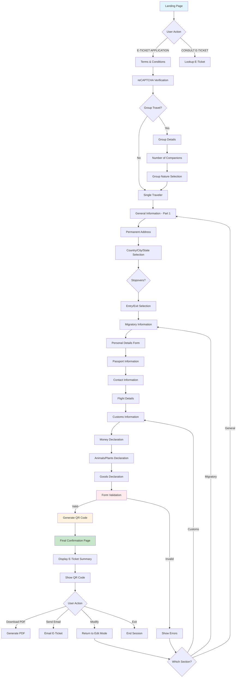

# User Flow Diagram - Current Dominican Republic E-Ticket System

## Overview

This diagram represents the complete user journey through the existing Dominican Republic E-Ticket system based on the screen analysis documented in [README.md](README.md).

## User Flow

## Key Flow Characteristics

### **Critical Decision Points**

1. **Group Travel Toggle**: Determines if additional group-specific fields are required
2. **Stopovers Question**: May affect travel documentation requirements
3. **Entry vs Exit**: Changes the context of subsequent questions
4. **Form Validation**: Single point of failure - all validation happens at the end

### **Pain Points Identified**

- **No Progress Saving**: Users must complete the entire flow in one session
- **Late Validation**: Errors are only shown after completing all steps
- **Limited Error Recovery**: Users must navigate back through potentially multiple sections
- **No Draft Capability**: Form data is lost if session expires or browser crashes

### **User Journey Insights**

- **Linear Progression**: Mostly sequential with minimal branching
- **High Abandonment Risk**: Long form with no intermediate saves
- **Manual Data Entry**: No automation features like passport scanning
- **Single Language Session**: No persistent language selection

## Implications for New System Design

### **Immediate Improvements Needed**

1. **Progressive Validation**: Validate each section before allowing progression
2. **Auto-Save Functionality**: Implement draft saving at each step
3. **Smart Forms**: Add more conditional logic to reduce irrelevant questions
4. **Progress Indicators**: Clear visual feedback on completion status
5. **Session Management**: Robust handling of timeouts and resumption

### **Architecture Considerations**

- **State Management**: Multi-step form state with persistence
- **API Design**: RESTful endpoints for each major section
- **Error Handling**: Granular validation with section-specific feedback
- **Data Structure**: Normalized data model supporting drafts and revisions

This flow analysis directly informs the development plan's Week 1-2 priorities for implementing improved form logic and user experience patterns.
